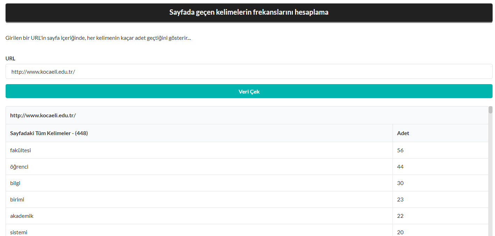

# WEB İNDEXLEME UYGULAMASI

Proje iki kısımdan oluşmaktadır; frontend ve backend. Frontend kısmında, Html, Css, Semantik ui react, ReactJs kullanılmıştır. Backend kısmında ise NodJs, ExpressJs altında webden veri çekmek için Puppeteer kütüphanesi kullanılmıştır.

## SAYFADA GEÇEN KELİMELERİN FREKANSLARINI HESAPLAMA
Bu bölüm de istenen ön yüzden girilen bir Url adresi içeriğindeki kelimeleri çıkaran ve bu kelimelerin sayfa içeriğinde kaçar adet geçtiğini hesaplayarak kullanıcıya gösteren bir tasarım ve bu tasarıma ait kodlamayı yapmaktır. 

### FrontEnd Bölümü
Uygulamanın ön yüzünde kullanıcının Url adresi girmesi için bir input ve girilen url e ait bilgileri getirecek “Veri Çek” isimli buton ekledik.
Butona tıkladıktan sonra aşağıda görüldüğü gibi sayfadaki kelimeler ve sayfada kaç adet bulunduğu listelenmektedir. Bu kısımda tüm kelimeler hiç bir ayrım gözetmeden listeleniyor ve sayfada kaç tür kelime olduğunuda tablonun başındaki (448) rakamıyla görebiliyoruz.

<!--  -->